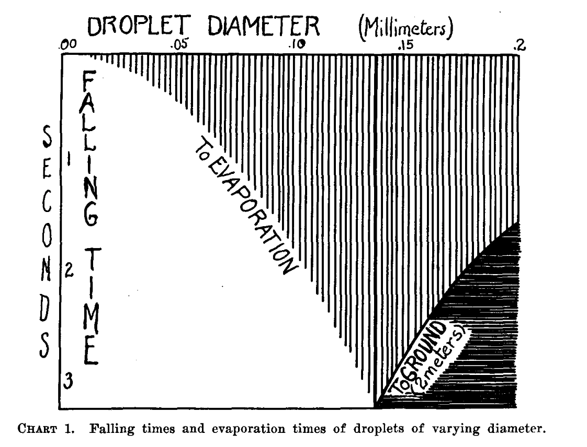
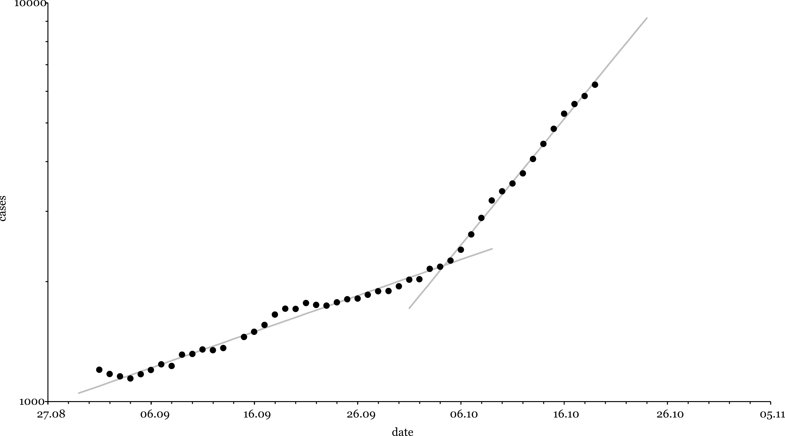

# COVID & Humidity 

## Introduction 
The code in this repository calculates Wells curves. A Wells curve describes the fate of a falling liquid droplet. On its way to the ground it can either evaporate completely or it can make it to the ground. If the droplet evaporates it will do so in a time t_e. If it makes it reaches the ground it will take the time t_H (H being the height of the fall). A Wells curve plots these times as a function of the initial radius r_0. The x-axis of a Wells curve is the radius r_0 and the y-axis is either t_e = t_e(r_0) or t_H = t_H(r_0) depending on whether the droplet evaporates or reaches the ground.

This is the original Wells curve (from [1]):

<p align="center">
  
</p>

There is a radius of special importance. This is the radius r_M where the droplet evaporates completely just as it reaches the ground. This radius is where the Wells curve has a kink. If a droplet has a radius to the left of r_0 it will evaporate. If it has a radius to the right of r_0 it will make it to the ground.

The program will produce plots like this (note that I have flipped the y-axis here):

<p align="center">
  
</p>

## Motivation
In the beginning of October '20 Germany experienced a sharp rise in the number COVID cases. The doubling time of new cases went from 33.2 days to 9.5 days in a matter of days. What happened?

<p align="center">
  
</p>

A conjecture is that with the arrival of fall and lower temperatures Germans started using their indoor heating and with it reduced the humidity in indoor spaces. The code here was written to see if the reduced humidity could influence the spread of the virus:

<p align="center">
  
</p>

The result of the calculation is:

* As the humidity **decreases** r_M (the position of the kink in the Wells curve) **increases**.

* When r_M increases **more droplets evaporate** instead of falling to the ground.

* More evaporation leads to **more airborne viruses**.

In a picture:

<p align="center">
  
</p>

There are more detailed descriptions of this in the [doc folder](./doc).

## Code organization
The organization of the source code (src folder) is as follows:

* **Executable** This folder contains the executable CalcWells and the class defining the command line parameters for it (WellsParams).

* **calc** Here you'll find the classes that perform the actual calculations.

* **helper** These are helper classes used in the calculation. E.g. you'll find a Reynolds class in here that calculates Reynolds numbers etc.

* **tests** Tests for the different classes.

## Code execution
There are two classes that contain main() methods. CalcWells calculates the Wells curve and FindRM finds the value of r_M. CalcWells is called with command line parameters that are explained in WellsParams. A typical call of CalcWells will contain these command line parameters:

```
-humidity 0.1 -startradius 100e-6 -endradius 200e-6 -stepsize 10e-6 -temperature 291.15 -height 1.7
```

For FindRM the humidity, the startradius, the endradius, and a guess are required:

```
-humidity 0.85 -startradius 30e-6 -endradius 100e-6 -guess 40e-6
```

The startradius and the endradius define an interval that the optimum is found in. guess is the initial guess.

There are also a number of unit tests that can be used to exexcute code.

## 

## Literature
 [1] Wells, W. , ON AIR-BORNE INFECTION: STUDY II. DROPLETS AND DROPLET NUCLEI,  American Journal of Epidemiology  20(3), 611-618 (1934). 